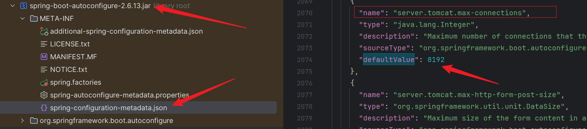
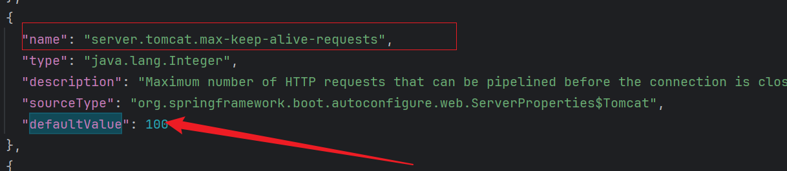

首先可以在Idea External Libraries找依赖包，如下图：



可以看出最大连接数是8192

但这并不是最终值，还需加上一个默认等待数：



即最大连接数为：8192+100 = 8292

当然也可以自定义：

```yml
server:
  tomcat:
    max-connections: 6000 # 最大连接数
    accept-count: 100 # 最大等待数
```


相似问题：

**SpringBoot默认可以同时处理多少个请求？**

​	取决于tomcat 默认线程池，其默认线程数是10，最大线程数是200，故而默认配置下同时可以处理200个请求。
